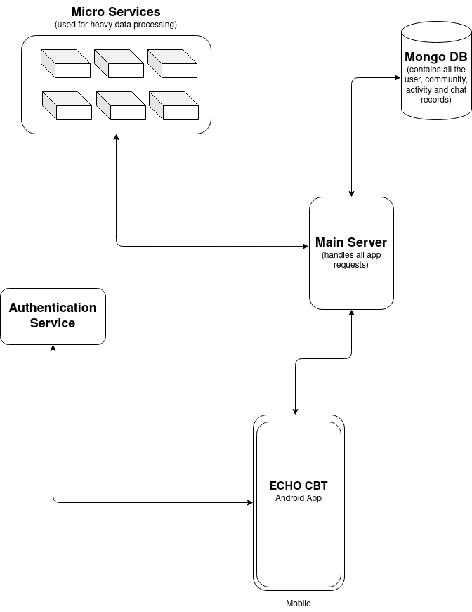

# Echo CBT

## Lets Fight Depression Together

 

## Introduction

Depression is a common illness worldwide with more than 264 million affected. Surprisingly, roughly 800000 commit suicide each year due to depression and/or stress. Echo-CBT presents you a Cognitive Behavioral Therapy (CBT) solution to help individuals recover from depression and track their growth while living their day to day life. Our team have researched a lot and come up with features that are a key for dealing with depression and stress, and work actively with therapists or guardians by providing them daily key insights into the patients life. The app helps the users become aware of inaccurate or negative thinking so you can view challenging situations better and respond to them more effectively. Our app also provides the user with a way to track their activities daily, this helps them understand what affects there daily mood so that they along with their guardian or therapist can promote activities which are beneficial for them.

 

## Platform Architecture

Technologies used:
1. Flutter
2. Nodejs
3. Expressjs
4. Flask
5. Google OAuth
6. Mongo Database Atlas
7. Docker
8. Obviously, GitHub

 

## Repo Layout

This repo mostly contains the idea behind the features of the app and how the whole platform interacts with different services

This complete list of Echo-CBT repos are:

- [Echo-CBT-App](https://github.com/Echo-CBT/Echo-CBT-App): Flask app
- [Echo-CBT-Server](https://github.com/Echo-CBT/Echo-CBT-Server): Main server handling all heavy computation and communication between micro services
- [ActivitySuggestion](https://github.com/Echo-CBT/ActivitySuggestion): Micro service used to fetch daily activity suggestions on the bases user activity tracking
- [RelationGraph](https://github.com/Echo-CBT/RelationGraph): Micro service used to generate relation graph of user diary entry
- [Echo-CBT-Website](https://github.com/Echo-CBT/Echo-CBT-Website): Main showcase website for thr project

 

## Features
|Feature Name   |Why    |
|--|--|
|Activity Tracking  | A key aspect that goes along with CBT is tracking the activities of a person in their daily routine. This helps our platform understand what activities or chores actually show an improvement in a person's mental health and fitness. Then we use these calculated benefits and show the person daily suggestions about activities that they should be doing more often to improve their mental health and overall well being. This also helps the therapist understand what activities are affecting their patient in what way.  |
|Diary Entries      | Sometimes we are not able to express ourselves in speech, but we are able to do so while writing a diary or a small note to ourselves. We encourage our users to write a small note about what they are feeling by the end of the day. The platform uses this note to build a relation graph which is then shared with both therapist/guardian and the user. This graph represents what entities affect the user in what way aiding the therapist/guardian to understand the root of the problem.  |
|Community Stories  | Many researches show that mental health problems such as depression and stress grow exponentially in people who are not able to express themselves and end up not sharing their problems. This leads to high level of anxiety. To counter this our platform provides a "Community Section" where our user's can share their feelings, problems and success with everyone using our platform while they remain completely anonymous. This helps them remove anxiety and helps them overcome the barrier of not being able to share their problems with others.   |
|Article Suggestion | We suggest our users motivational articles that would help them gain confidence, courage, strength and motivate them to live a more free and stress less life.   |

 

## Suggestions and Feature Requests
We are open to all suggestions, ideas, feature request and discussions, if you any please feel free to open an issue [here](https://github.com/Echo-CBT/Echo-CBT/issues)

 

##### Made with ❤️ by Team Echo

